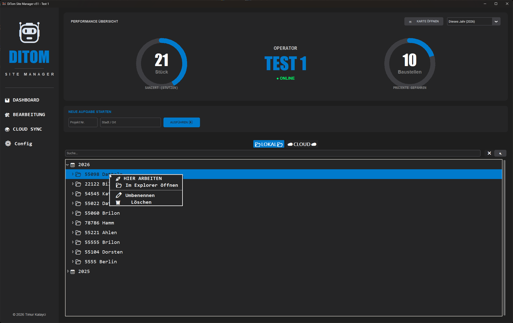

# 🤖 DiTom Site Manager v53 "Total Swarm"

**Das dezentrale Betriebssystem für moderne Kanalsanierungs-Flotten. Lokal autark, global vernetzt.**

Der **DiTom Site Manager v53** ist eine High-End-Dokumentationssoftware für Sanierungs-Operatoren. Er verbindet lokale Hochleistungs-Dokumentation mit einem serverlosen Cloud-Backend ("Swarm"), um den Workflow zwischen mehreren Anlagen zu koordinieren, ohne dass eigene Server oder IT-Infrastrukturen benötigt werden.

---

## 🛠️ 1. Erstnutzung & Grundkonfiguration
Bevor der erste Roboter in den Schacht fährt, muss das System kalibriert werden. Dies geschieht im Einstellungs-Menü.

* **Basis-Pfad:** Wähle den Pfad zu deiner "Baustellen-Platte" (externe SSD/HDD). Das System scannt diesen Pfad sofort und baut dein lokales Archiv auf.
* **Identität:** Gib deiner Anlage einen Namen (z. B. "Roboter 1"). Dieser Name ist im Cloud-Schwarm für alle Kollegen sichtbar.
* **GitHub-Integration:** Hinterlege dein Token und die Repo-Daten. Dies aktiviert die dezentrale Synchronisation.
* **Theme-Engine:** Wähle aus **10 professionellen Designs** (z. B. *Bio-Neural, Corporate Dark, Midnight Blue*), um die UI perfekt auf die Lichtverhältnisse im Regiewagen abzustimmen.

---

## 🏗️ 2. Das Dashboard (Control Center)
Das Dashboard ist dein zentraler Einstiegspunkt. Es visualisiert deine Performance und den Systemstatus.

* **Live-Gauges:** Die digitalen Tachos für sanierte Stutzen und Baustellen reagieren live auf deine Filter. Die Farben passen sich dynamisch deinem gewählten Theme an.
* **Online-Status:** Ein Hintergrund-Thread prüft ständig deine Internetverbindung. Du siehst sofort, ob der Cloud-Schwarm erreichbar ist.
* **Projekt-Schnellstart:** Gib einfach **Projekt-Nr.** und **Stadt** ein. Das System prüft Cloud & Lokal und erstellt sofort die Tagesstruktur.

---

## 🔍 3. Archiv, Suche & Baum-Logik
Die Navigation im lokalen Archiv ist auf maximale Geschwindigkeit optimiert.

* **Echtzeit-Filter:** Suche nach Städten, Nummern oder Daten. Der Treeview filtert während du tippst.
* **Jahres-Sortierung:** Deine Daten werden automatisch nach Jahren gruppiert, wobei das aktuelle Jahr standardmäßig geöffnet ist.

### 🖱️ Das mächtige Kontext-Menü (Rechtsklick)
Ein Rechtsklick im Baum bietet dir folgende Profi-Optionen:

1.  **🚀 HIER ARBEITEN:** Öffnet das Projekt sofort im Arbeitsmodus, egal in welchem Jahr es liegt.
2.  **📂 Im Explorer öffnen:** Springt direkt in den Windows-Ordner – kein mühsames Suchen mehr.
3.  **✏️ Umbenennen:** Korrigiere Tippfehler direkt in der App. Das System benennt den Ordner auf der Platte um.
4.  **🗑️ Löschen:** Entfernt Altlasten sicher von der Festplatte (mit Sicherheitsabfrage).

---

## 🛠️ 4. Der Arbeitsmodus (Operationelle Ebene)
Hier findet die tägliche Sanierungs-Dokumentation statt. Alles ist auf minimale Klicks ausgelegt.

* **Maßnahmen-Management:** Erstelle mit `[+] ORDNER` sofort die korrekte Struktur basierend auf Meter-Angabe und Typ (z. B. `14,20m Stutzen`).
* **Intelligente Video-Logik:** Der Recorder prüft lokal und in der Cloud: "Welche Nummer ist als Nächstes dran?". So wird niemals ein Video eines Kollegen überschrieben.
* **📡 OBS UPDATE:** Sendet Straße, Haltung und DN direkt an OBS Studio für dein Video-Overlay.
* **Historie (Rechts):** Blaue Einträge zeigen Daten von Kollegen aus der Cloud. Grüne Einträge liegen bereits lokal auf deiner Platte. Ein Klick importiert die Struktur sofort für heute.

---

## ☁️ 5. Cloud Swarm & Mapping

### Synchronisation
Abgleich der Tageserfolge mit der gesamten Flotte über das serverlose GitHub-Backend.

* **Ghost Mode:** In der Cloud-Ansicht siehst du, was andere Roboter tun.

* **Cloud-Import:** Ein Doppelklick auf eine Cloud-Haltung importiert die Struktur ("Ghost-Ordner") zu dir lokal, damit du nahtlos weiterarbeiten kannst.

### Satelliten-Karte
Visualisierung aller Projektstandorte direkt auf einer interaktiven Karte.

* Nutzt **Google Satelliten-Layer** für maximale Präzision auf der Baustelle.
* Automatische Geocodierung deiner Standorte über die Nominatim API.

---

## 📊 6. Profi-Tools: Aufmaß & Reporting

### Smart Aufmaß
Kein manuelles Kopieren von Excel-Tabellen mehr.

* **Auto-Teil-Aufmaß:** Das System findet dein letztes Aufmaß (z. B. Teil 2) und erstellt automatisch "Teil 3" als Kopie deiner Vorlage.

### HTML-Reporting
Erstelle mit einem Klick professionelle Berichte.

* Generiert sofort eine druckfertige HTML-Übersicht aller Medien und Dateien der aktuellen Haltung für den Bauleiter.

---

## ⚙️ 7. Technische Architektur & Fixes (v53)

### Der sichere Neustart-Prozess
Um den berüchtigten `init.tcl`-Fehler bei EXEs zu beheben, nutzt v53 eine intelligente Prozesssteuerung:
* **Hybrid-Restart:** Die App erkennt, ob sie als Skript oder EXE läuft. Bei einer EXE wird ein frischer `subprocess` gestartet, während die alte Instanz sauber beendet wird. Dies stellt sicher, dass alle Tcl-Bibliotheken korrekt neu geladen werden.
* **Geometry-Fix:** Die App speichert beim Schließen ihre Fenstergröße und Position – außer sie war maximiert. Dies verhindert Layout-Fehler beim nächsten Start.

### Build-Struktur (`_internal`)
Die Software wird im `--onedir` Modus kompiliert.
* **WICHTIG:** Alle Bibliotheken und Assets liegen im Ordner `_internal`. Dieser muss zwingend zusammen mit der `.exe` ausgeliefert werden.
* **Performance:** Durch `onedir` startet die App deutlich schneller, da nicht bei jedem Start temporäre Dateien entpackt werden müssen.

### Changelog
* **v53:** Kritischer Fix für EXE-Settings-Speicherung und Neustart-Logik.
* **v52:** Design-Fix: Gauges nutzen nun dynamische `ring_color` passend zum Theme.
* **v51:** Einführung der SHA-Check-Logik zur Vermeidung von Cloud-Upload-Konflikten.

---

## 📝 Lizenz & Copyright
Proprietäre Software für professionelle Sanierungs-Teams.
**Entwickelt von Timur Kalayci**
*Copyright © 2024-2026 - DiTom Site Manager Team.*
*Präzision im Schacht, Ordnung im System.*
