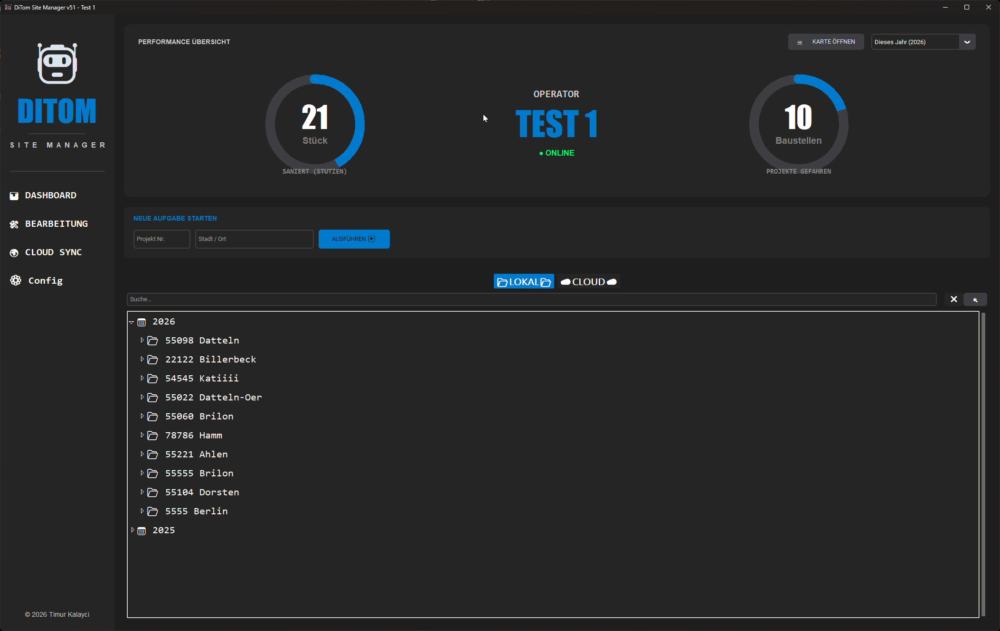
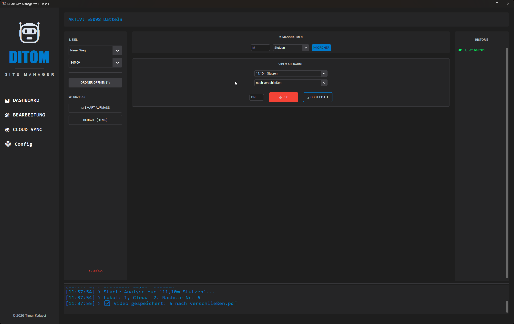
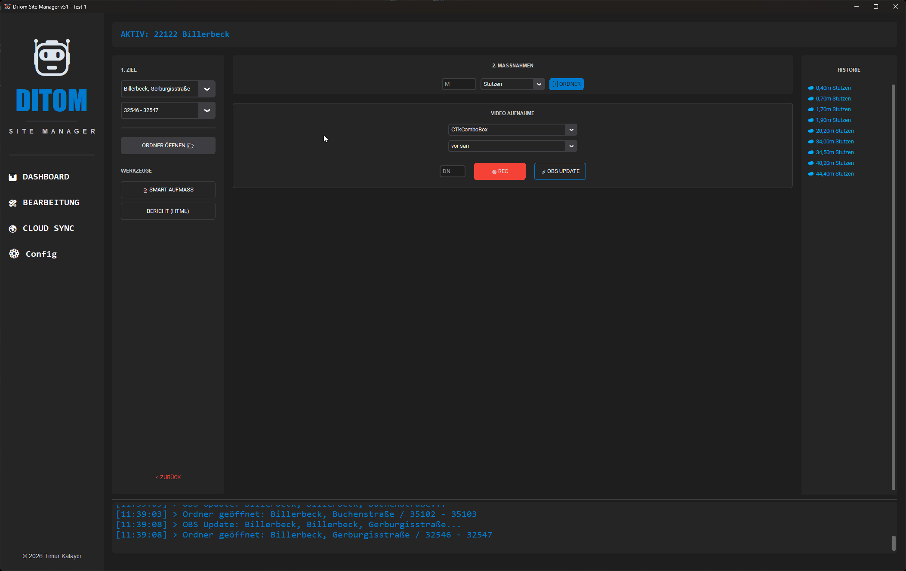
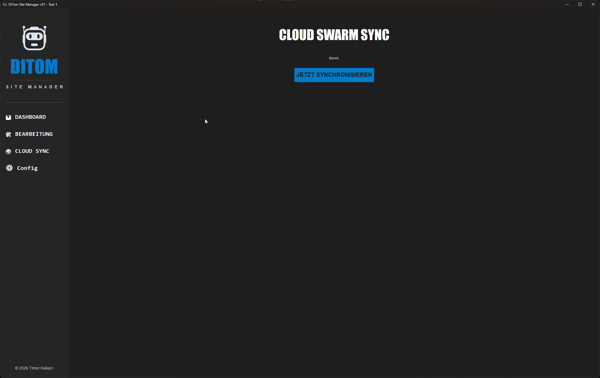

🤖 DiTom Site Manager v53 "Total Swarm"

Das dezentrale Betriebssystem für moderne Kanalsanierungs-Flotten.
Lokal autark. Global vernetzt. Maximal effizient.

Der DiTom Site Manager v53 ist eine spezialisierte Dokumentations- und Management-Software für Sanierungsroboter. Sie kombiniert lokale Hochgeschwindigkeits-Dateiverwaltung mit einer innovativen "Swarm"-Architektur: Anstatt auf teure Server zu setzen, nutzt DiTom ein GitHub-Repository als Echtzeit-Datenbank.

🚀 Neu in Version 53 (High-Priority Fixes)

Diese Version bringt massive Stabilitätsverbesserungen für den täglichen Einsatz:

⚡ Intelligenter Prozess-Neustart: Behebt den kritischen init.tcl-Fehler bei kompilierten EXEs. Die App erkennt ihren Laufzeit-Kontext und führt bei Config-Änderungen einen sauberen subprocess-Neustart durch.

🎨 Dynamische Theme-Engine 2.0: Die ModernGauge-Widgets (Tachos) passen nun auch ihre Ring-Farben (ring_color) dynamisch an das gewählte Theme an.

🛡️ Windows-Pfad-Sicherheit: Die Synchronisation (backend_swarm.py) wurde gehärtet. JSON-Daten werden nun per String-Slicing statt Regex injiziert, um Fehler mit Backslashes in Pfaden zu verhindern.

🏗️ 1. Das Dashboard (Control Center)

Das Dashboard ist dein zentraler Einstiegspunkt. Es visualisiert deine Performance und den Systemstatus in Echtzeit.

Live-Gauges: Die digitalen Tachos zeigen sanierte Stutzen und abgeschlossene Baustellen. Die Farben passen sich dynamisch deinem Theme an.

Online-Status: Ein Hintergrund-Thread prüft via DNS-Lookup (8.8.8.8) permanent die Verbindung zum Swarm.

Schnellstart: Gib einfach Projekt-Nr. und Stadt ein. Das System prüft Cloud & Lokal und erstellt sofort die Tagesstruktur.

🛠️ 2. Konfiguration & Setup

Bevor der erste Roboter startet, wird das System hier kalibriert.

Identität: Gib deiner Anlage einen Namen (z. B. "Roboter 1").

Basis-Pfad: Wähle den Root-Pfad deiner externen Baustellen-Festplatte.

Theme-Engine: Wähle aus 10 professionellen Designs (z. B. Corporate Dark, Bio-Neural), optimiert für die Arbeit im Regiewagen.

Gefahrenzone: Hier können verwaiste Cloud-Daten des Roboters gelöscht werden.

🔍 3. Archiv & Intelligente Navigation

Die Navigation ist auf maximale Geschwindigkeit optimiert. Der Treeview filtert Tausende von Ordnern in Millisekunden.

Das Kontext-Menü

Ein Rechtsklick bietet direkten Zugriff auf Profi-Funktionen:

🚀 HIER ARBEITEN: Lädt das Projekt sofort in den Arbeitsmodus.

📂 Im Explorer öffnen: Kein mühsames Suchen mehr im Windows Explorer.

✏️ Umbenennen: Benennt Ordner sicher auf Dateisystemebene um.

🗑️ Löschen: Entfernt Altlasten (mit Sicherheitsabfrage).

🏗️ 4. Arbeitsmodus (The Workbench)

Hier findet die tägliche Dokumentation statt. Alles ist auf minimale Klicks ausgelegt.

Ghost-Structure: Das Dropdown zeigt blau markierte Einträge – das sind Daten, die Kollegen bereits in der Cloud angelegt haben. Ein Klick übernimmt die Struktur.

Smart-Recorder: Der "REC"-Button prüft Lokal UND in der Cloud, welche Videonummer als nächstes frei ist.

Beispiel: Kollege A hat 1 vor san.mp4 hochgeladen. DiTom vergibt automatisch 2 vor san.mp4.

📡 OBS UPDATE: Sendet Projektdaten (Stadt, Straße, Haltung) in Echtzeit an OBS Studio für Video-Overlays.

☁️ 5. Cloud Swarm Sync

Abgleich der Tageserfolge mit der gesamten Flotte über das serverlose GitHub-Backend.

Ghost Mode: In der Cloud-Ansicht (Reiter "CLOUD") siehst du in Echtzeit, an welchen Projekten andere Roboter gerade arbeiten.

Sync: Ein Klick synchronisiert deinen lokalen Stand (obs_live.txt, Ordnerstruktur, Statistiken) mit dem globalen HTML-Template.

📊 6. Profi-Tools
Smart Aufmaß

Kein manuelles Kopieren von Excel-Tabellen mehr.

Das System scannt nach dem letzten Aufmaß (z. B. "Teil 2") – egal ob lokal oder im Swarm.

Es erstellt automatisch "Teil 3" als Kopie der Vorlage und öffnet es.

HTML-Reporting & Maps

Bericht: Generiert eine Tagesbericht.html mit einer Übersicht aller Medien der Haltung.

Satellite Map: Erstellt eine interaktive Karte (map_view.html) aller Projektstandorte basierend auf den Städtenamen.

⚙️ Technische Details (Build)

Die Software wird mittels PyInstaller im --onedir Modus gebaut, um Startzeiten zu minimieren.

Wichtig für EXE-Nutzer:
Die Datei DiTom_Site_Manager_v53.exe darf NICHT aus ihrem Ordner bewegt werden. Der Ordner _internal enthält die Python-Runtime und muss immer neben der EXE liegen.

code
Bash
download
content_copy
expand_less
# Build Befehl
python build_exe.py
📝 Lizenz & Copyright

DiTom Site Manager ist proprietäre Software für professionelle Kanalsanierungs-Unternehmen.

Entwickler: Timur Kalayci

Copyright: © 2026

Lizenz: Closed Source / Interne Nutzung.
